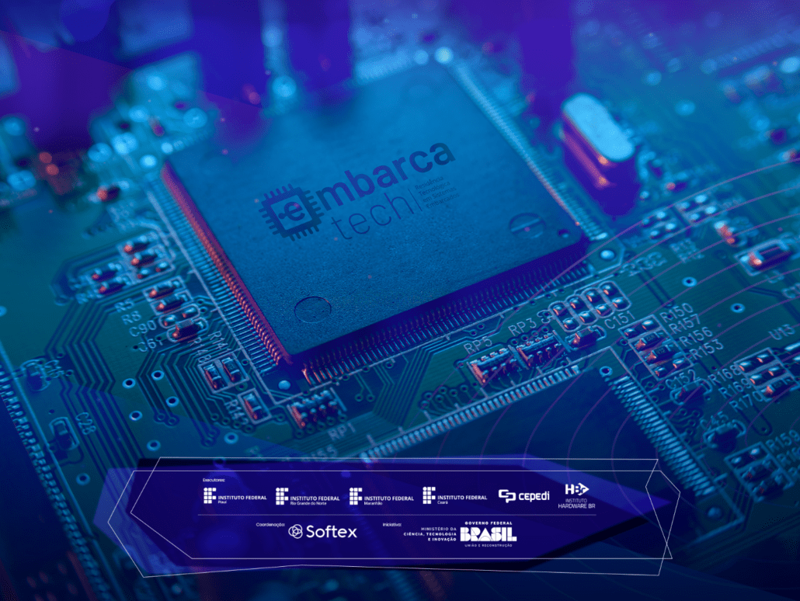
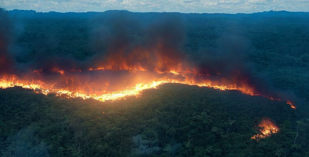
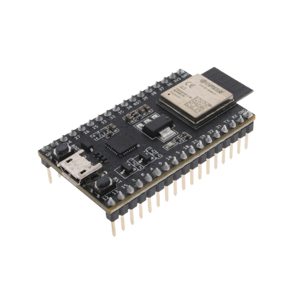
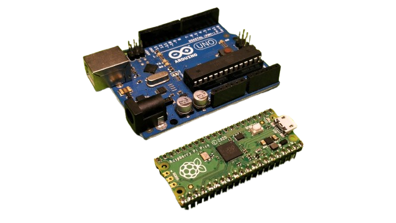
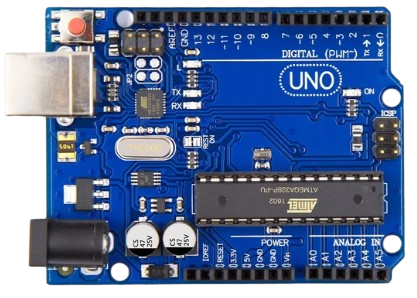
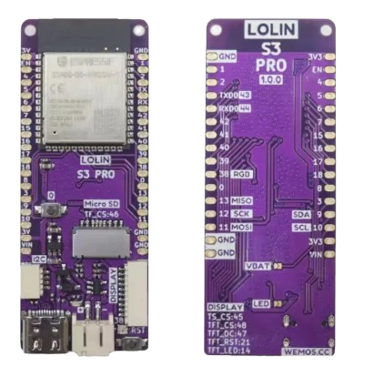
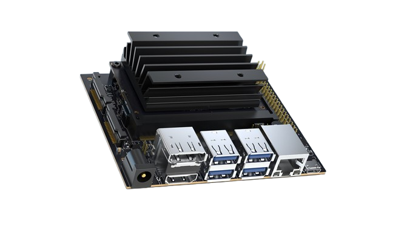
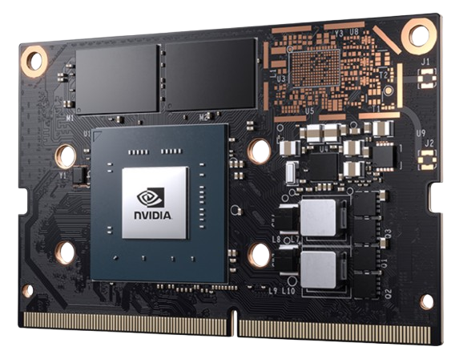
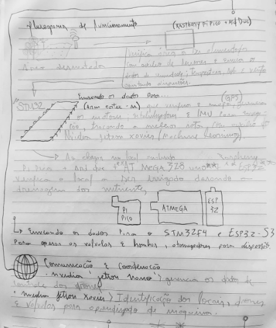
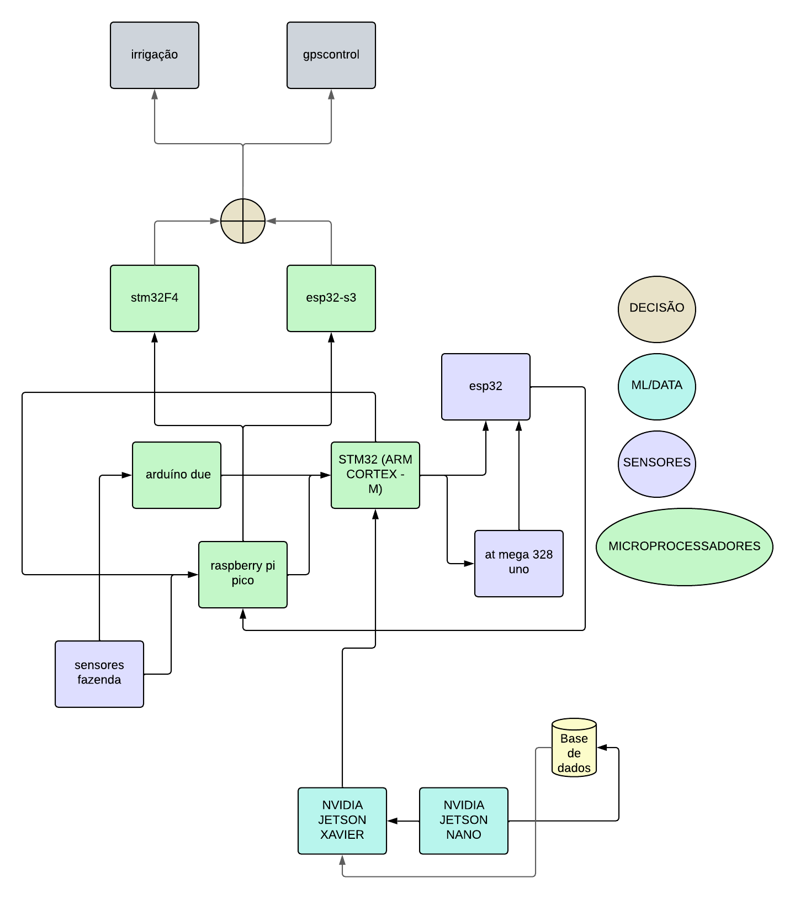

# Bioreators 

EmbarcaTech - tarefa prática sobre Aplicações de Internet das Coisas e Sistemas Embarcados.

---

**Descrição do problema prático**

A degradação de ecossistemas naturais devido a desmatamento, poluição, mudanças climáticas e atividades humanas intensivas tem provocado a perda de biodiversidade, erosão do solo e desequilíbrio ambiental. 

Recuperar essas áreas é um processo lento, caro e muitas vezes ineficiente, dado o difícil acesso a regiões remotas e a limitação de métodos manuais tradicionais. 

Além disso, a regeneração de solos pobres e contaminados é um desafio significativo, exigindo soluções que promovam a fertilidade e a sustentabilidade do ecossistema.

[veja mais...](https://www.tempo.com/noticias/actualidade/sim-o-desmatamento-na-amazonia-provoca-reducao-de-chuvas-na-america-do-sul-clima-brasil.html)

---

**Solução IoT centrada em microcontroladores**

O uso de drones equipados com bioreatores e tecnologia de chuva artificial pode transformar esse cenário, proporcionando uma abordagem inovadora e eficiente para a regeneração ambiental. 

Esses drones podem dispersar sementes encapsuladas em bioreatores contendo nutrientes, microrganismos benéficos e bioestimulantes diretamente nas áreas degradadas. 

A inclusão de sistemas de chuva artificial controlada permite a aplicação de água em regiões de difícil acesso, garantindo umidade suficiente para a germinação e o desenvolvimento inicial das plantas. 

Essa combinação de tecnologias acelera a regeneração do solo, melhora a taxa de germinação e permite a recuperação de áreas extensas com precisão, economia de recursos e impacto ambiental positivo.

---

### Microprocessadores Necessários:  

---

1. **Controle de Voo**
   
   - **STM32 (ARM Cortex-M), ESP32**   
   - Gerencia motores, estabilizadores, GPS e IMU para navegação.
  
---

2. **Sensores Ambientais**
   
   - **Raspberry Pi Pico, Arduino Due**   
   - Processa dados de umidade, temperatura, solo e vento, ajustando dispersões.  

---

3. **Gestão dos Bioreatores**
   
   - **ATmega328 (Arduino Uno), ESP32**   
   - Controla liberação de sementes e dosagem de nutrientes.  

---

4. **Sistema de Chuva Artificial**
   
   - **STM32F4, ESP32-S3** 
   - Opera bombas, válvulas e atomizadores para dispersão de água.  

---

5. **Comunicação e Coordenação**
   
   - **NVIDIA Jetson Nano**
   - **Qualcomm Snapdragon Flight**
   - Coordena drones em rede, processa mapas e rotas.

---

6. **Machine Learning**
   
   - **NVIDIA Jetson Xavier NX, Coral Edge TPU**
   - Analisa imagens, identifica áreas degradadas e otimiza decisões.

---

### **Resumo das Conexões e Fluxo de Dados:**

1. **Controle de Voo (STM32/ESP32)**  
   Conecta-se aos sensores (IMU, GPS), motores e sistemas de comunicação (LoRa/WiFi) para controlar o voo do drone.

2. **Sensores Ambientais (Raspberry Pi Pico/Arduino Due)**  
   Coleta dados sobre umidade, temperatura, vento e solo. Envia essas informações para o controle de voo e comunicação com outros drones.

3. **Gestão dos Bioreatores (ATmega328/ESP32)**  
   Controla os motores e bombas que liberam sementes e nutrientes. Coordena com o controle de voo para sincronizar a liberação com a posição do drone.

4. **Chuva Artificial (STM32F4/ESP32-S3)**  
   Controla bombas e atomizadores para irrigação, sincronizando com o movimento do drone e ajustando com base nos dados ambientais.
   

5. **Comunicação e Coordenação (NVIDIA Jetson Nano/Qualcomm Snapdragon Flight)**  
   Gerencia a rede de drones, processa dados em tempo real (GPS, IMU) e otimiza as rotas de voo.
   

6. **Machine Learning (NVIDIA Jetson Xavier NX/Coral Edge TPU)**  
   Analisa imagens e dados dos sensores para identificar áreas degradadas e otimizar a dispersão de sementes e água.

---

### **Fluxo de Dados:**
- Drones se comunicam entre si e com um centro de controle onde o machine learning analisa dados.
- O **controle de voo** ajusta a trajetória do drone, enquanto **sensores** e **algoritmos de ML** ajustam a dispersão de sementes e irrigação com base nas condições ambientais em tempo real.

---

**MIT Licence ©**

